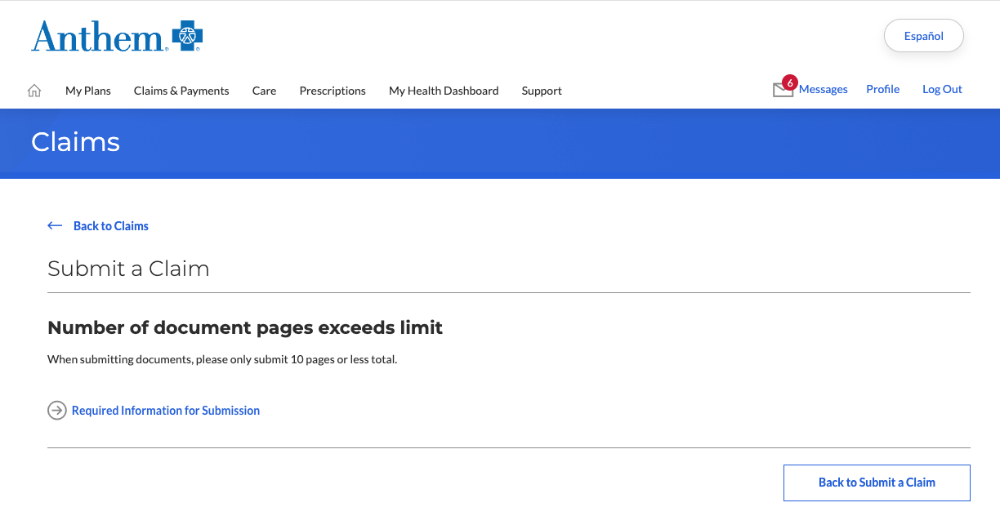

# not today anthem

https://www.anthem.com/ca has the most annoying and arbitrary rules for sending out-of-network claims: you can only attach pdfs with total of 10 or less pages.

Like what they been thinking? This is medical industry every bloody pdf in it is like 20 pages long.

So here is how you make every pdf to be just a single page. A single image. With no pdf metadata.

## setup

```bash
uv pip install pdf2image
```

## mass-convert a folder of pdfs

```bash
python ./stitch_pdfs.py /path/to/input_folder /path/to/output_folder
```

### Before



### After


